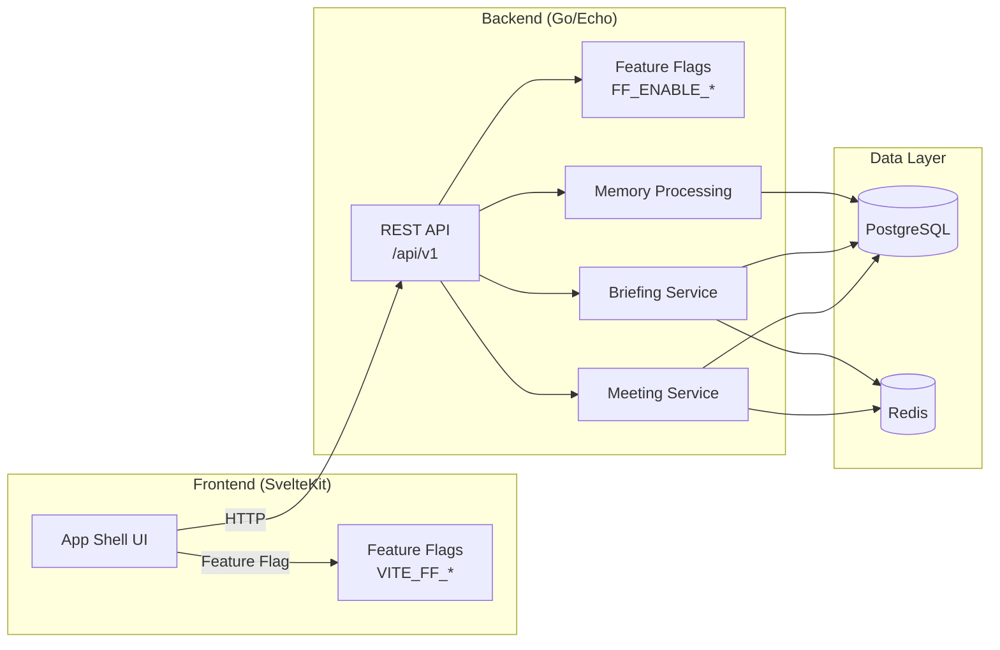

# ContextPilot

> Never walk into a meeting cold again.

ContextPilot is a meeting intelligence system that helps you remember what happened in previous conversations and surfaces the most relevant information before your next call.

## Features

- **Pre-Call Briefing** — Get a concise briefing before any meeting with decisions, action items, open questions, and stakeholder notes from previous meetings.
- **Meeting Memory** — Automatically extract summary, decisions, action items, risks, and open questions from meeting transcripts.
- **What Changed Since Last Time** — See what happened between meetings: completed action items, new blockers, updated decisions.
- **Dashboard** — See upcoming meetings, briefings due, and where your attention is needed.
- **Manual Import** — First release supports manual meeting creation and transcript paste. Platform integrations (Teams, Meet, Zoom) are future work.

## Quick Start

### Prerequisites

- Docker + Docker Compose
- Go 1.26+ (for backend development)
- Node 22+ and pnpm 10.32+ (for frontend development)

### Phase 0 — Governance (current state)

```bash
# Verify governance scaffold
make sync-check   # must exit 0
make eval-arch   # all arch evals skip (no source)
make help        # lists all targets

# Start infrastructure (Phase 1 ready)
docker compose up -d

# Verify infra
docker compose config   # must pass
curl http://localhost:8025   # Mailpit UI (SMTP capture)
```

### Phase 1 — Development (pending review)

```bash
# After Phase 0 review is complete
make dev   # starts infrastructure + backend + frontend dev server
```

### Feature Flags (local demo)

```bash
FF_ENABLE_APP_SHELL=true make dev   # enable app shell
```

---

## Project Structure

```
.
├── AGENTS.md                    # Agent operating rules
├── STATUS.md                    # Working memory — backlog, decisions, progress
├── README.md                    # This file
├── Makefile                     # Orchestration
├── .env.example                 # Feature flag defaults
├── .github/workflows/eval.yml    # CI pipeline
├── backend/                     # Go/Echo REST API (Phase 1)
├── frontend/                    # SvelteKit app (Phase 1)
├── contracts/                   # API schemas + event contracts
├── docs/
│   ├── adr/                     # Architecture decision records
│   ├── security-baseline.md
│   └── observability.md
├── evals/                       # Eval contracts + fitness functions
├── scripts/                     # Dev + CI scripts
├── specs/
│   ├── _template.md             # BRD template
│   ├── feature-flags.md         # Flag registry
│   └── ui/brd-01-app-shell.md  # First BRD
└── docker-compose.yml           # PostgreSQL, Redis, Mailpit
```

---

## Stack

| Layer | Technology |
|-------|------------|
| Backend | Go 1.26 + Echo v4 |
| Frontend | SvelteKit + TypeScript |
| Database | PostgreSQL 16 |
| Cache | Redis 7 |
| Package manager | pnpm 10.32.1 |
| Email (dev) | Mailpit |

---

## Architecture



---

## Feature Flags

All features are behind flags. Defaults are `false` until implemented.

| Flag | Description |
|------|-------------|
| `FF_ENABLE_APP_SHELL` | Layout, navigation, core pages |
| `FF_ENABLE_MANUAL_MEETING_IMPORT` | Manual meeting creation + transcript paste |
| `FF_ENABLE_MEETING_MEMORY_PROCESSING` | Meeting → memory extraction |
| `FF_ENABLE_PRE_CALL_BRIEFING` | Briefing generation |
| `FF_ENABLE_PROVIDER_CONNECTORS` | Teams, Meet, Zoom (future) |
| `FF_ENABLE_PRIVACY_RETENTION_CONTROLS` | PII masking, data retention |
| `FF_ENABLE_MANUAL_MEMORY_CORRECTION` | User corrections |

---

## Development

### Scripts

```bash
make help              # List all targets
make sync-check        # Verify governance parity
make eval-arch         # Run architecture fitness functions
make doctor            # Check Docker, CLIs, ports
make dev               # Start infrastructure
make seed-dev          # Load seed data (Phase 1+)
make clean             # Remove build artifacts
```

### CI Pipeline

See `.github/workflows/eval.yml`. Key jobs:
- **Architecture** — Runs `evals/architecture/check-*.sh` on every push
- **Sync Check** — Runs `scripts/check-status-sync.sh`
- **Backend/Frontend** — Skipped until Phase 1 (gated with `if: false`)
- **Security** — Trufflehog scan, dependency audit

---

## Troubleshooting

### Port conflicts

```bash
# PostgreSQL port 5432 in use?
lsof -i :5432
# Override: DATABASE_PORT=5433 make dev

# Frontend port 5173 in use?
lsof -i :5173
# Override: FRONTEND_PORT=5174 make dev
```

### Docker issues

```bash
# Reset infrastructure
docker compose down -v
docker compose up -d

# View logs
docker compose logs -f
docker compose logs postgres
```

### doctor.sh failures

```bash
# Run doctor with debug
bash -x scripts/doctor.sh
```

---

## Contributing

1. Branch from `main`: `git checkout -b brd-01/description`
2. Implement behind feature flag
3. Write evals before code
4. Run `make sync-check` before PR
5. Open PR with eval evidence, screenshots, flag status

---

## Phase Roadmap

| Phase | Scope | Status |
|-------|-------|--------|
| Phase 0 | Governance scaffold | In Progress |
| Phase 1 | Backend + Frontend skeleton | Pending |
| Phase 2 | BRD implementation (App Shell, Manual Import, Memory, Briefing) | Pending |