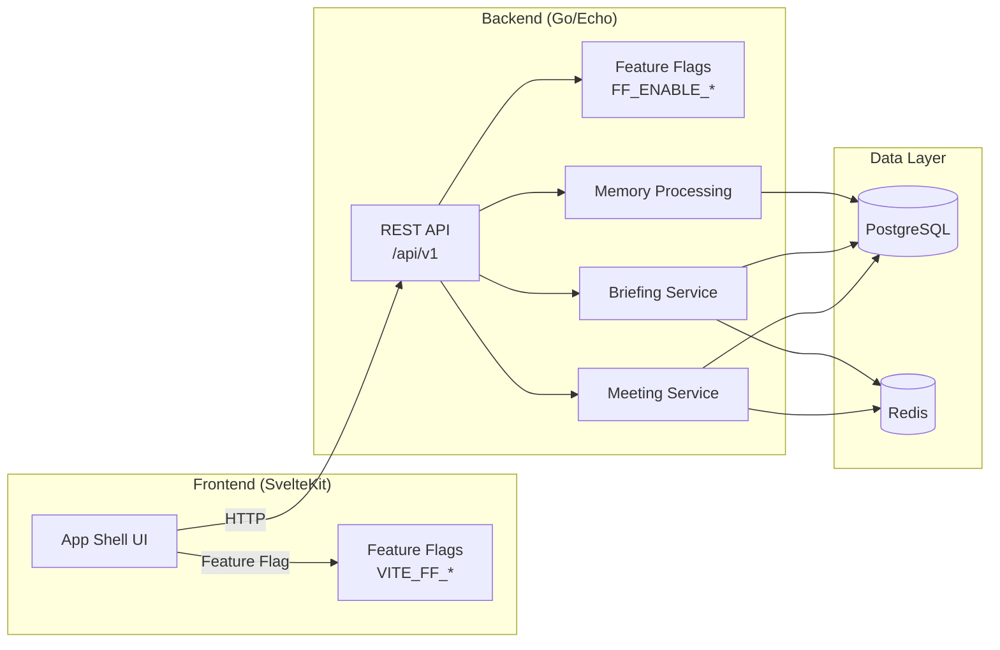

# ContextPilot

> Never walk into a meeting cold again.

ContextPilot is a meeting intelligence system that helps you remember what happened in previous conversations and surfaces the most relevant information before your next call.

> **Read this first:** This project tracks three states explicitly and you should keep them straight.
> - **Implemented** — source code exists in the working tree
> - **Gates Green** — committed code passes `go test`, `go vet`, `make eval-arch`, `make sync-check`, and CI on the committed ref
> - **Production-Ready** — `done-auditor` returned Trustworthy / Mostly trustworthy with no P0/P1 blockers for the relevant feature
>
> Many features below are Implemented but NOT yet Gates Green on a commit (recovery work is currently in an uncommitted working tree on `ops/restore-ci-baseline`). See [STATUS.md](./STATUS.md) → "Recovery state" for the current honest picture.

## Features

- **Pre-Call Briefing** — Get a concise briefing before any meeting with decisions, action items, open questions, and stakeholder notes from previous meetings.
- **Meeting Memory** — Automatically extract summary, decisions, action items, risks, and open questions from meeting transcripts.
- **What Changed Since Last Time** — See what happened between meetings: completed action items, new blockers, updated decisions.
- **Dashboard** — See upcoming meetings, briefings due, and where your attention is needed.
- **Manual Import** — First release supports manual meeting creation and transcript paste. Platform integrations (Teams, Meet, Zoom) are future work.

## Quick Start

### Prerequisites

- Docker + `docker-compose` v1 (this environment does not have `docker compose` v2; use `docker-compose` v1)
- Go 1.26+ (for backend development)
- Node 22+ and pnpm 10.32+ (for frontend development)

### Verify governance (always green)

```bash
make sync-check      # governance parity — must exit 0
make eval-arch       # architecture fitness functions (no-panic, no-context.Background, all flags registered, no BRD open items, no sensitive content in logs) — must exit 0
make help            # list all targets
```

### Start infrastructure

```bash
docker-compose up -d                    # postgres, redis, mailpit
docker-compose config                   # must pass
curl http://localhost:8025              # Mailpit UI (SMTP capture)
```

> **Why `docker-compose` (v1) and not `docker compose` (v2):** this runtime has `docker-compose` v1 (Docker Compose version v5.0.2). `docker compose` v2 is not installed. The Makefile and `scripts/doctor.sh` use `docker-compose` v1 throughout; `make demo-check` exits non-zero on real config failure.

### Run tests locally (what CI runs)

```bash
make eval             # blocking: arch + backend go test/vet + frontend svelte-check/build — exits non-zero on any failure
make eval-report      # non-blocking diagnostics: e2e, integration, security, perf
```

> **Current state caveat (2026-06-01):** `make eval` is green on the *working tree* on `ops/restore-ci-baseline` (arch + backend + frontend all pass). On the committed ref `89f250f` the same command fails (briefing package has a build error and `internal/upcoming` tests fail). The recovery work is not yet committed. See STATUS.md → "Recovery state" for details.

### Feature Flags (local demo)

```bash
FF_ENABLE_APP_SHELL=true make dev   # enable app shell for local UI
```

See `specs/feature-flags.md` for the full lifecycle registry.

---

## Project Structure

```
.
├── AGENTS.md                    # Agent operating rules
├── STATUS.md                    # Working memory — backlog, decisions, progress
├── README.md                    # This file
├── Makefile                     # Orchestration
├── .env.example                 # Feature flag defaults
├── .github/workflows/eval.yml    # CI pipeline
├── backend/                     # Go/Echo REST API — implemented
├── frontend/                    # SvelteKit app — implemented
├── contracts/                   # API schemas + event contracts
├── docs/
│   ├── adr/                     # Architecture decision records
│   ├── security-baseline.md
│   └── observability.md
├── evals/                       # Eval contracts + fitness functions
├── scripts/                     # Dev + CI scripts
├── specs/
│   ├── _template.md             # BRD template
│   ├── feature-flags.md         # Flag registry
│   ├── ui/brd-01-app-shell.md   # First BRD
│   └── curated/                 # Curated BRD packages (02–05)
└── docker-compose.yml           # PostgreSQL, Redis, Mailpit
```

---

## Stack

| Layer | Technology |
|-------|------------|
| Backend | Go 1.26 + Echo v4 |
| Frontend | SvelteKit + TypeScript |
| Database | PostgreSQL 16 |
| Cache | Redis 7 |
| Package manager | pnpm 10.32.1 |
| Email (dev) | Mailpit |

---

## Architecture



---

## Feature Flags

All features are behind flags. Defaults are `false` until implemented.

| Flag | Description |
|------|-------------|
| `FF_ENABLE_APP_SHELL` | Layout, navigation, core pages |
| `FF_ENABLE_MANUAL_MEETING_IMPORT` | Manual meeting creation + transcript paste |
| `FF_ENABLE_MEETING_MEMORY_PROCESSING` | Meeting → memory extraction |
| `FF_ENABLE_PRE_CALL_BRIEFING` | Briefing generation |
| `FF_ENABLE_PROVIDER_CONNECTORS` | Teams, Meet, Zoom (future) |
| `FF_ENABLE_PRIVACY_RETENTION_CONTROLS` | PII masking, data retention |
| `FF_ENABLE_MANUAL_MEMORY_CORRECTION` | User corrections |

---

## Development

### Scripts

```bash
make help              # List all targets
make sync-check        # Verify governance parity
make eval-arch         # Run architecture fitness functions
make eval              # Run BLOCKING evals (arch + backend + frontend) — exits non-zero on any failure
make eval-report       # Run NON-BLOCKING diagnostics (e2e, integration, security, perf)
make doctor            # Check Docker, CLIs, ports
make dev               # Start infrastructure
make clean             # Remove build artifacts
```

### CI Pipeline

See `.github/workflows/eval.yml`. Key jobs (all blocking on push to `main` and any `**/brd-**` branch):
- **Architecture** — Runs `evals/architecture/check-*.sh` on every push.
- **Sync Check** — Runs `scripts/check-status-sync.sh`.
- **Backend** — `cd backend && go vet ./... && go test ./...`.
- **Frontend** — installs pnpm with frozen lockfile, then runs `svelte-check`, `pnpm test`, and `pnpm build`. The `lint` step is a no-op (the project has no `lint` script in `package.json`); CI mirrors the local `make lint` SKIP behavior.
- **Security** — installs `gosec` via `go install` and runs `gosec -severity=low -confidence=low ./...` against `backend/`. TruffleHog runs via the official `trufflehog-actions/trufflehog@v0.0.10` action. Both fail the build on findings.
- **E2E** — installs Node + pnpm + Playwright Chromium (with system deps), then `docker compose up -d` (or `docker-compose up -d` on legacy v1 hosts), waits for backend `/healthz` and frontend root, then `pnpm exec playwright test --reporter=list`.
- **Summary** — collects all job results into a single table; exits non-zero if any core blocking job failed.

> **Local dry-run equivalent:** `make ci-local` (or `make ci-local-skip-e2e` to skip the heavy E2E gate) runs every blocking gate in the same order as CI. `make ci-e2e` and `make ci-security` are split out for when you only need one. Underlying scripts live in `scripts/ci-local-dry-run.sh`, `scripts/ci-e2e.sh`, `scripts/ci-security.sh`.

> **Note:** the workflow exists and is enforceable, but as of 2026-06-01 there is **no GitHub remote** — CI cannot run end-to-end until Shakil creates/connects a repo and pushes. The local dry-run is the only path to verify CI parity right now. See STATUS.md → "Recovery state".

---

## Troubleshooting

### Port conflicts

```bash
# PostgreSQL port 5432 in use?
lsof -i :5432
# Override: DATABASE_PORT=5433 make dev

# Frontend port 5173 in use?
lsof -i :5173
# Override: FRONTEND_PORT=5174 make dev
```

### Docker issues

```bash
# Reset infrastructure
docker-compose down -v
docker-compose up -d

# View logs
docker-compose logs -f
docker-compose logs postgres
```

> **Reminder:** this environment uses `docker-compose` v1, not `docker compose` v2. If you copy commands from older docs or blog posts that say `docker compose`, they will fail (`docker: unknown command: docker compose`).

### doctor.sh failures

```bash
# Run doctor with debug
bash -x scripts/doctor.sh
```

---

## Contributing

1. Branch from `main`: `git checkout -b brd-01/description`
2. Implement behind feature flag
3. Write evals before code
4. Run `make sync-check` before PR
5. Open PR with eval evidence, screenshots, flag status

---

## Phase Roadmap

Each row uses the three-state vocabulary from the top of this README. **Impl** = code exists, **Gates Green** = committed code passes `make eval` on the committed ref, **Prod-Ready** = `done-auditor` returned Trustworthy / Mostly trustworthy with no P0/P1.

| Phase | Scope | Impl | Gates Green | Prod-Ready |
|-------|-------|------|-------------|------------|
| Phase 0 | Governance scaffold, contracts, evals, CI infra, specs | Yes | Yes (`make eval-arch` and `make sync-check` are green on `89f250f`) | No — pre-feature |
| Phase 1 | Backend + Frontend skeleton (appshell, meeting, memory, briefing, upcoming) | Yes | Partial — only `89f250f` is committed; the recovery code from t_5d9f1c92 / t_dc615711 / t_e51a46af is in the working tree but not yet committed, so the committed ref does not pass `make eval` | No — awaiting done-auditor re-audit after recovery is committed |
| Phase 2 | BRD implementation (BRD-01 → BRD-05) | Mostly (BRD-01, BRD-02, BRD-03, BRD-04, BRD-05) | No — same recovery-state caveat | No — done-auditor final gate not run |